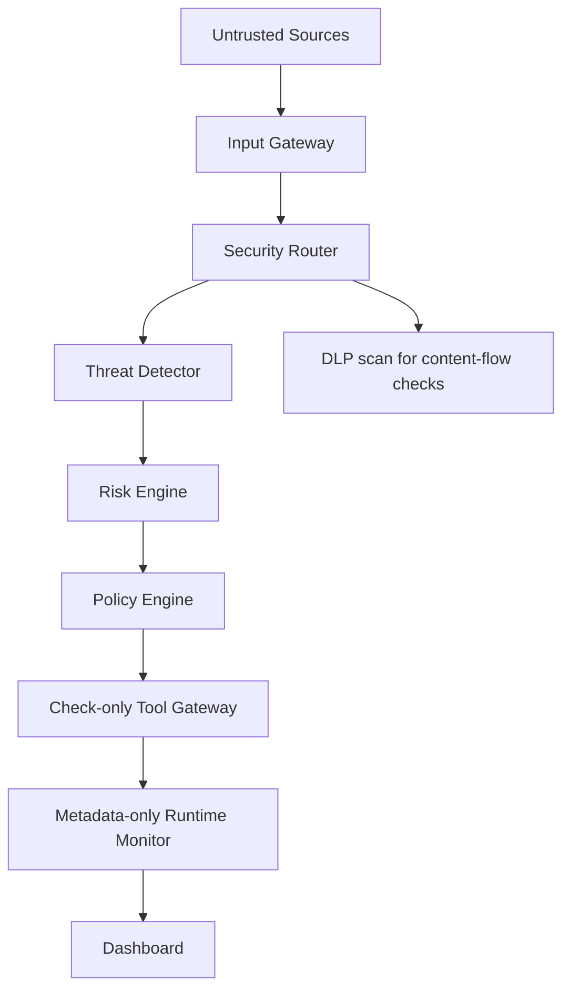

# AgentShield

**AI Agent Runtime Security & Data Loss Prevention Platform**

AgentShield is a cybersecurity hackathon project for designing runtime safeguards around AI agents. The repository includes a deterministic check-only security pipeline, local policy and DLP checks, metadata-only monitoring, an Attack Lab, and a dashboard. It does not execute tools or authenticate agent identities.

## 1. Overview

AI agents can read untrusted content and call tools that reach sensitive data or external systems. AgentShield is intended to place explicit security controls around those interactions so an agent's behavior can be inspected, authorized, and audited.

**Current implementation:** FastAPI application, Input Gateway, threat detection, risk scoring, local policy evaluation, bounded DLP scanning, check-only tool authorization, synthetic demonstration agent scopes, in-process audit monitoring, and a dashboard. Environment-backed settings and a SQLAlchemy SQLite engine/session foundation are also present, but there are no database models or migrations. The health endpoint confirms that the HTTP service responds; it does not check database connectivity.

## 2. Problem Statement

Instructions embedded in documents, web pages, emails, API responses, and database records may try to redirect an agent. If the agent can use tools or access sensitive information without an independent authorization layer, a malicious instruction could lead to unauthorized actions or data exposure.

## 3. Our Solution

The design treats agent input as potentially untrusted and places security controls outside the language model. The Security API applies detection, risk, policy, applicable DLP, and permission checks, then records safe metadata. The Tool Gateway is check-only: no tool, transfer, or requested action is executed.

## 4. Key Security Capabilities

| Capability | Status |
| --- | --- |
| FastAPI service and health endpoint | Implemented |
| Environment-based settings and SQLite session foundation | Implemented |
| Input validation, normalization, hashing, and metadata capture | Implemented |
| Security Router and check-only API interfaces | Implemented |
| Metadata-only security decision logging | Implemented |
| Prompt-injection and malicious-instruction detection | Implemented, deterministic |
| Risk scoring and policy enforcement | Implemented, local rules |
| DLP pattern scanning | Implemented, bounded; unmatched content is not certified safe |
| Independent data classification | Incomplete; caller labels are not independently verified |
| Tool authorization gateway | Implemented, check-only; no execution |
| Synthetic agent permission registry | Demonstration only; no identity authentication |
| Runtime monitoring and dashboard | Implemented, bounded in-process data |
| Local Ollama chat | Security-gated local inference with DLP output screening; pattern-based controls have limits |

## 5. Architecture

The Security Router delegates to explicit component interfaces. Tool execution and the agent remain outside this project runtime.



The core security principle is: **“The AI model is not treated as a trusted security boundary. Authorization and security decisions are enforced outside the model.”** Policy failures deny by default. See [docs/security-router.md](docs/security-router.md) and [docs/architecture.md](docs/architecture.md).

## 6. Technology Stack

- Python 3.12+
- FastAPI and Pydantic
- Pillow, pytesseract, and python-multipart for bounded image upload and OCR
- SQLAlchemy with SQLite
- PyYAML and python-dotenv
- pytest and HTTPX for API tests

## 7. Project Structure

```text
AgentShield/
├── backend/
│   ├── api/             # Health, input, and security routes
│   ├── core/            # Settings and logging
│   ├── database/        # SQLAlchemy engine and sessions
│   ├── detector/        # Deterministic threat detection
│   ├── gateway/         # Input normalization and check-only tool gateway
│   ├── monitor/         # Bounded metadata-only decision logging
│   ├── policy/          # Risk, DLP, policy, and demo agent permissions
│   └── main.py          # FastAPI application
├── demo_data/           # Reserved for synthetic demo fixtures
├── docs/                # Architecture and security plans
├── tests/               # Automated tests
├── .github/workflows/   # CI test workflow
├── .env.example
├── .gitignore
├── LICENSE
├── README.md
└── requirements.txt
```

## 8. Installation

Run from the AgentShield project root in Windows PowerShell:

```powershell
Set-Location C:\Users\Downloads\AgentShield
py -3.12 -m venv .venv
.\.venv\Scripts\python.exe -m pip install -r requirements.txt
```

Image analysis also requires the external Tesseract OCR engine; installing the Python package `pytesseract` alone is not sufficient. Install Tesseract locally. On Windows, AgentShield detects `C:\Program Files\Tesseract-OCR\tesseract.exe` when present. Set `TESSERACT_CMD` to the executable path in other locations or environments.

## 9. Configuration

`.env.example` contains safe placeholders. Copy it to `.env` for local configuration, replace placeholders locally, and never commit `.env`. The current application reads `DATABASE_URL`; it defaults to `sqlite:///./agentshield.db`. Input limits are configurable with `INPUT_MAX_CONTENT_BYTES`, `INPUT_MAX_SOURCE_NAME_LENGTH`, and `INPUT_MAX_METADATA_BYTES`. `SECRET_KEY` and `DEBUG` are legacy placeholders and are not consumed by the current implementation. `LLM_API_KEY` is also a legacy placeholder; the local Ollama integration does not use an API key. The current settings also accept optional `SERVICE_NAME` and `LOG_LEVEL` environment variables; their defaults are `AgentShield` and `INFO`.

Image uploads are bounded by `IMAGE_MAX_UPLOAD_BYTES` (default 5 MiB) and `IMAGE_MAX_PIXELS` (default 12 million pixels). `TESSERACT_CMD` optionally selects the Tesseract executable. The image endpoint decodes PNG/JPEG data with Pillow, performs local OCR, and sends extracted text through the existing untrusted-file analysis path. Empty OCR results return a fail-closed `REVIEW`. OCR does not establish that an image is safe; image instructions remain untrusted, and links or QR destinations are never opened.

The local LLM integration uses `OLLAMA_BASE_URL` (default `http://localhost:11434`), `OLLAMA_MODEL` (default `qwen2.5:3b`), and `OLLAMA_TIMEOUT_SECONDS` (default 30 seconds). `LLM_MAX_MESSAGE_CHARS` limits user messages (default 16,384 characters; maximum configurable value 32,768). Install and start Ollama separately, then manually install the selected model, for example `ollama pull qwen2.5:3b`. AgentShield never downloads models during startup or requests. No API key is needed for the local default configuration.

## 10. Running the Application

From the project root:

```powershell
.\.venv\Scripts\python.exe -m uvicorn backend.main:app --reload
```

The service listens at `http://127.0.0.1:8000`. The current endpoint is `http://127.0.0.1:8000/health`; interactive API documentation is at `http://127.0.0.1:8000/docs`.

The Input Gateway accepts normalized input at `POST http://127.0.0.1:8000/api/v1/inputs`. The check-only Security API is under `/api/v1/security`; see [docs/security-router.md](docs/security-router.md) for its request contracts and limitations, including the demonstration-only agent IDs.

Image uploads use `POST /api/v1/security/analyze-image` with a multipart `file` field. Only decoded PNG and JPEG images are accepted. The endpoint does not retain uploaded files or return OCR text.

The LLM API is under `/api/llm`. `GET /api/llm/health` reports whether Ollama is reachable and whether the configured model is installed; it does not install or download a model. `POST /api/llm/chat` accepts one JSON `message` field. Example PowerShell request:

```powershell
$body = @{ message = "Summarize the public project notes." } | ConvertTo-Json
Invoke-RestMethod -Method Post -Uri http://127.0.0.1:8000/api/llm/chat `
  -ContentType "application/json" -Body $body
```

The chat route submits the message to the existing Input Gateway and security analysis pipeline first. Only an assessed final `ALLOW` reaches Ollama. Generated text is scanned by the existing local DLP patterns and is withheld on a detected secret or an inconclusive scan. This is not a complete privacy or factual-safety guarantee: pattern-based DLP can miss sensitive content, model output is untrusted, and AgentShield never executes tools or actions suggested by a model.

## 11. Running Tests

```powershell
.\.venv\Scripts\python.exe -m pytest -v
```

For the focused image tests:

```powershell
.\.venv\Scripts\python.exe -m pytest tests/security/test_image_security.py tests/security/test_image_gateway.py -q
```

For the mocked Ollama integration tests (no local model is required):

```powershell
.\.venv\Scripts\python.exe -m pytest tests/security/test_llm_api.py -q
```

The image-security tests mock OCR and do not require Tesseract to be installed. To test real OCR manually, install the external Tesseract executable and configure `TESSERACT_CMD` if it is not found at the Windows default path or on `PATH`.

GitHub Actions runs the same test suite on pushes and pull requests.

## 12. Security Design Principles

The security model follows least privilege, deny by default, defense in depth, external authorization, tool isolation, data classification, auditability, secure logging, secret management, and fail-safe behavior. Independent content classification, authenticated identity, tool execution, and persistent audit storage are not provided. Details are in [docs/security-model.md](docs/security-model.md).

## 13. Threat Model

The threat model covers untrusted text and metadata supplied through the API, including prompt injection, unauthorized tool requests, credential exposure, and data exfiltration. See [docs/threat-model.md](docs/threat-model.md). The project does not connect to customer data sources or execute agent tools. Local model input is gated by the deterministic security pipeline; this does not authenticate callers or make model output inherently safe.

## 14. Attack Scenarios

Synthetic Attack Lab scenarios exercise detector behavior without connecting to attack infrastructure or external targets. See [docs/attack-scenarios.md](docs/attack-scenarios.md).

## 15. Roadmap

1. Replace demonstration agent IDs with authenticated server-side identity.
2. Implement independent, validated data classification.
3. Add durable, access-controlled audit storage when deployment requirements are defined.
4. Continue expanding adversarial tests and documenting measured behavior.

No real agent tool execution or customer data integration is planned without a separate capability boundary and explicit authorization design.

## 16. Team / Hackathon Information

Team names, event name, and submission details have not been provided. Add them here when available.

## 17. License

This project is distributed under the MIT License. See [LICENSE](LICENSE).
