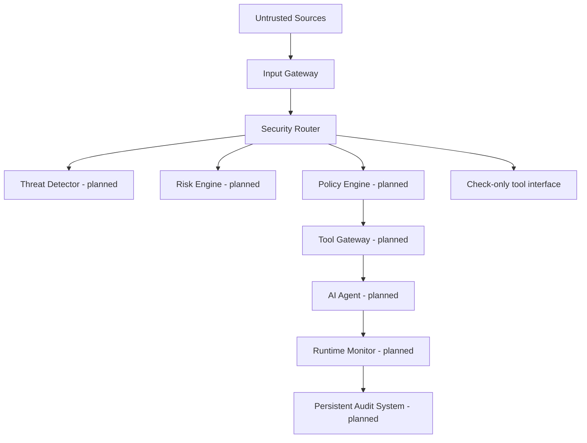

# AgentShield

**AI Agent Runtime Security & Data Loss Prevention Platform**

AgentShield is a cybersecurity hackathon project for designing runtime safeguards around AI agents. The repository currently contains a small FastAPI service foundation. The security modules described below are planned work; they are not implemented in this version.

## 1. Overview

AI agents can read untrusted content and call tools that reach sensitive data or external systems. AgentShield is intended to place explicit security controls around those interactions so an agent's behavior can be inspected, authorized, and audited.

**Current implementation:** FastAPI application, `GET /health`, the Input Gateway, a check-only Security API, environment-backed settings, console logging, and a SQLAlchemy SQLite engine/session foundation. There are no database models or migrations yet. The health endpoint confirms that the HTTP service responds; it does not check database connectivity.

## 2. Problem Statement

Instructions embedded in documents, web pages, emails, API responses, and database records may try to redirect an agent. If the agent can use tools or access sensitive information without an independent authorization layer, a malicious instruction could lead to unauthorized actions or data exposure.

## 3. Our Solution

The design treats agent input as potentially untrusted and places security controls outside the language model. The current Security API exposes decision-only interfaces; the threat detector, risk engine, and policy engine are still unimplemented. Its check endpoints fail closed and never execute tools or actions.

## 4. Key Security Capabilities

| Capability | Status |
| --- | --- |
| FastAPI service and health endpoint | Implemented |
| Environment-based settings and SQLite session foundation | Implemented |
| Input validation, normalization, hashing, and metadata capture | Implemented |
| Security Router and check-only API interfaces | Implemented |
| Metadata-only security decision logging | Implemented |
| Prompt-injection and malicious-instruction detection | Planned |
| Risk scoring and policy enforcement | Planned |
| Tool execution gateway and data-leakage prevention | Planned |
| Runtime monitoring, audit evidence, and dashboard | Planned |

## 5. Architecture

The current Security Router delegates to explicit component interfaces. Detection, risk scoring, policy evaluation, tool execution, and the agent remain planned.



The core security principle is: **“The AI model is not treated as a trusted security boundary. Authorization and security decisions are enforced outside the model.”** The current check-only endpoints deny actions while policy evaluation is unavailable. See [docs/security-router.md](docs/security-router.md) and [docs/architecture.md](docs/architecture.md).

## 6. Technology Stack

- Python 3.12+
- FastAPI and Pydantic
- SQLAlchemy with SQLite
- PyYAML and python-dotenv
- pytest and HTTPX for API tests

## 7. Project Structure

```text
AgentShield/
├── backend/
│   ├── api/             # Health, input, and security routes
│   ├── core/            # Settings and logging
│   ├── database/        # SQLAlchemy engine and sessions
│   ├── detector/        # Threat detector interface stub
│   ├── gateway/         # Input normalization and tool check interface
│   ├── monitor/         # Metadata-only decision logging
│   ├── policy/          # Risk, classification, and policy interfaces
│   └── main.py          # FastAPI application
├── demo_data/           # Reserved for synthetic demo fixtures
├── docs/                # Architecture and security plans
├── tests/               # Automated tests
├── .github/workflows/   # CI test workflow
├── .env.example
├── .gitignore
├── LICENSE
├── README.md
└── requirements.txt
```

## 8. Installation

Run from the AgentShield project root in Windows PowerShell:

```powershell
Set-Location C:\Users\Downloads\AgentShield
py -3.12 -m venv .venv
.\.venv\Scripts\python.exe -m pip install -r requirements.txt
```

## 9. Configuration

`.env.example` contains safe placeholders. Copy it to `.env` for local configuration, replace placeholders locally, and never commit `.env`. The current application reads `DATABASE_URL`; it defaults to `sqlite:///./agentshield.db`. Input limits are configurable with `INPUT_MAX_CONTENT_BYTES`, `INPUT_MAX_SOURCE_NAME_LENGTH`, and `INPUT_MAX_METADATA_BYTES`. `LLM_API_KEY`, `SECRET_KEY`, and `DEBUG` are placeholders for future modules and are not consumed by the current implementation. The current settings also accept optional `SERVICE_NAME` and `LOG_LEVEL` environment variables; their defaults are `AgentShield` and `INFO`.

## 10. Running the Application

From the project root:

```powershell
.\.venv\Scripts\python.exe -m uvicorn backend.main:app --reload
```

The service listens at `http://127.0.0.1:8000`. The current endpoint is `http://127.0.0.1:8000/health`; interactive API documentation is at `http://127.0.0.1:8000/docs`.

The Input Gateway accepts normalized input at `POST http://127.0.0.1:8000/api/v1/inputs`. The check-only Security API is under `/api/v1/security`; see [docs/security-router.md](docs/security-router.md) for its request contracts and limitations. Threat detection and policy evaluation remain planned.

## 11. Running Tests

```powershell
.\.venv\Scripts\python.exe -m pytest -v
```

GitHub Actions runs the same test suite on pushes and pull requests.

## 12. Security Design Principles

The planned security model follows least privilege, deny by default, defense in depth, external authorization, tool isolation, data classification, auditability, secure logging, secret management, and fail-safe behavior. These controls are design goals, not current runtime capabilities. Details are in [docs/security-model.md](docs/security-model.md).

## 13. Threat Model

The planned threat model covers malicious users and poisoned content from files, web pages, email, APIs, and databases. Risks include prompt injection, unauthorized tool use, privilege escalation, credential exposure, and data exfiltration. See [docs/threat-model.md](docs/threat-model.md). The project does not currently ingest these sources or execute agent tools.

## 14. Attack Scenarios

Synthetic future test plans cover direct injection, malicious file/web/email instructions, poisoned database records, unauthorized database or tool access, and sensitive-data exfiltration. They are documentation only; no attack infrastructure or external targets are included. See [docs/attack-scenarios.md](docs/attack-scenarios.md).

## 15. Roadmap

1. Add synthetic fixtures and architecture-level interfaces.
2. Design input inspection and threat classification.
3. Add external policy evaluation and a deny-by-default tool gateway.
4. Add runtime event recording and audit queries.
5. Build a dashboard after the backend security controls are established.
6. Expand adversarial tests and document measured behavior.

All items above are planned.

## 16. Team / Hackathon Information

Team names, event name, and submission details have not been provided. Add them here when available.

## 17. License

This project is distributed under the MIT License. See [LICENSE](LICENSE).
