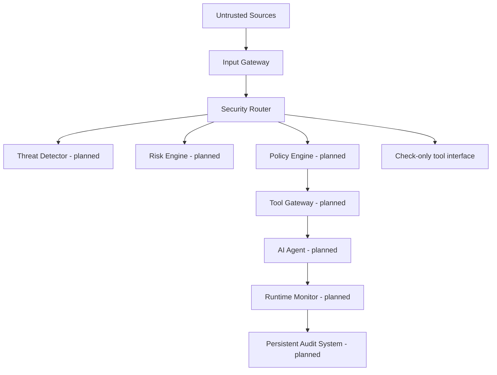

# AgentShield Architecture

This document separates the implemented service and API interfaces from planned security enforcement components.

## Architecture flow

## Current implementation

- `backend/main.py` creates the FastAPI application.
- `backend/api/health.py` exposes `GET /health` and returns the configured service name.
- `backend/core/config.py` loads environment-backed settings, including a SQLite URL.
- `backend/core/logging_config.py` configures console logging.
- `backend/database/database.py` defines the SQLAlchemy engine, declarative base, session factory, and request-scoped session dependency.
- `backend/gateway/input_gateway.py` validates and normalizes submitted content, marks it untrusted, hashes it, and attaches metadata.
- `backend/api/inputs.py` exposes the versioned input endpoint.
- `backend/api/security.py` exposes check-only security endpoints and reports component status.
- `backend/core/security_service.py` connects those endpoints to dedicated component interfaces.
- `backend/detector/threat_detector.py` and `backend/policy/risk_engine.py` return explicit not-implemented results; they do not detect threats or score risk.
- `backend/policy/policy_engine.py` provides fail-closed decision stubs; it has no policy rules or identity evaluation.
- `backend/gateway/tool_gateway.py` checks authorization only and does not execute tools.
- `backend/monitor/audit_logger.py` logs decision metadata without content, tool arguments, or targets; it is not a persistent audit store.
- `tests/test_health.py`, `tests/test_input_gateway.py`, and `tests/test_security.py` cover the health, input, and security APIs.

There is no agent, threat detection, risk scoring, policy evaluation, tool execution, persistent audit store, or dashboard. Security check endpoints are interfaces only and deny authorization while policy evaluation is unavailable. The Input Gateway does not interpret or execute content. The database foundation has no models, migrations, or application data yet. The health endpoint does not probe the database.

## Security Router behavior

`backend/api/security.py` exposes `POST /api/v1/security/analyze`, `POST /api/v1/security/check-tool`, `POST /api/v1/security/check-data`, `POST /api/v1/security/check-action`, and `GET /api/v1/security/status`. The analyze route always passes input through the Input Gateway before calling the threat and risk interfaces. Results explicitly say `not_implemented` or `not_assessed`; they do not claim that content is safe. Tool, data, and action checks are decision-only and fail closed. None execute requested operations. See [security-router.md](security-router.md) for request and response contracts.

## Planned components

### Input Gateway

Accepts agent tasks and content from configured sources, labels source and trust context, validates size and format, and passes normalized input downstream. It should preserve provenance so later controls know which text came from the user and which came from retrieved content.

### Instruction / Threat Detector

Inspects untrusted instructions and content for suspicious attempts to override task boundaries, extract data, or trigger unsafe actions. Detection produces structured signals and evidence for risk evaluation; the detector does not grant permissions.

### Risk Engine

Combines detector signals, source trust, requested action, data sensitivity, and action impact into a documented risk result. It should provide reasons and evidence rather than silently making authorization decisions.

### Policy Engine

Evaluates a proposed action against explicit policy, identity, scope, and risk constraints. It returns allow, deny, or require-review decisions and defaults to deny when policy is missing or evaluation fails.

### Tool Gateway

Provides the only path from the agent to tools. It validates each request against policy, exposes narrow capabilities, validates arguments, applies limits, and records the outcome. The agent should not receive direct credentials or unrestricted network/database access.

### AI Agent

Plans and responds to tasks using only approved context and tools. The model may propose actions, but it is not an authorization authority and cannot override external policy decisions.

### Runtime Monitor

Observes input, decisions, tool calls, data movement, and failures. It emits structured events while avoiding unnecessary sensitive content in logs.

### Audit System

Stores tamper-aware, access-controlled records of decisions and actions, including timestamps, policy versions, source references, and outcomes. Retention and redaction rules must be defined before production use.

### Dashboard

Presents authorized users with security events, blocked actions, policy decisions, and system health. It should not expose secrets or unrestricted raw content.

## Security boundary

The model is not a trusted security boundary. The Security Router and its safe interfaces exist, but enforcement controls are not implemented. No action should execute based on the current placeholder responses; a future Tool Gateway must enforce external policy before execution.
