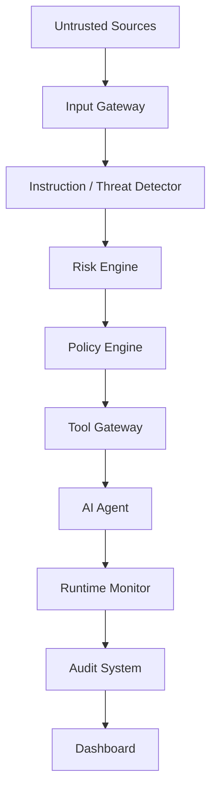

# AgentShield Architecture

This document describes the target architecture and separates it from the code that exists today. The security components below are planned; this repository does not yet implement or connect them.

## Architecture flow

## Current implementation

- `backend/main.py` creates the FastAPI application.
- `backend/api/health.py` exposes `GET /health` and returns the configured service name.
- `backend/core/config.py` loads environment-backed settings, including a SQLite URL.
- `backend/core/logging_config.py` configures console logging.
- `backend/database/database.py` defines the SQLAlchemy engine, declarative base, session factory, and request-scoped session dependency.
- `tests/test_health.py` covers the health route.

There are no agent, tool, policy, threat-detection, audit, or dashboard components. The database foundation has no models, migrations, or application data yet. The health endpoint does not probe the database.

## Planned components

### Input Gateway

Accepts agent tasks and content from configured sources, labels source and trust context, validates size and format, and passes normalized input downstream. It should preserve provenance so later controls know which text came from the user and which came from retrieved content.

### Instruction / Threat Detector

Inspects untrusted instructions and content for suspicious attempts to override task boundaries, extract data, or trigger unsafe actions. Detection produces structured signals and evidence for risk evaluation; the detector does not grant permissions.

### Risk Engine

Combines detector signals, source trust, requested action, data sensitivity, and action impact into a documented risk result. It should provide reasons and evidence rather than silently making authorization decisions.

### Policy Engine

Evaluates a proposed action against explicit policy, identity, scope, and risk constraints. It returns allow, deny, or require-review decisions and defaults to deny when policy is missing or evaluation fails.

### Tool Gateway

Provides the only path from the agent to tools. It validates each request against policy, exposes narrow capabilities, validates arguments, applies limits, and records the outcome. The agent should not receive direct credentials or unrestricted network/database access.

### AI Agent

Plans and responds to tasks using only approved context and tools. The model may propose actions, but it is not an authorization authority and cannot override external policy decisions.

### Runtime Monitor

Observes input, decisions, tool calls, data movement, and failures. It emits structured events while avoiding unnecessary sensitive content in logs.

### Audit System

Stores tamper-aware, access-controlled records of decisions and actions, including timestamps, policy versions, source references, and outcomes. Retention and redaction rules must be defined before production use.

### Dashboard

Presents authorized users with security events, blocked actions, policy decisions, and system health. It should not expose secrets or unrestricted raw content.

## Security boundary

The model is not a trusted security boundary. The planned authorization and security decisions are enforced by components outside the model, with the Tool Gateway preventing direct tool access. These controls are not implemented in the current foundation.
